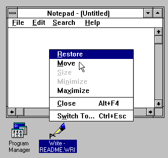

:arrow_backward: [The state of Windows](README.md)

# The abysmal state of Taskbar icons of Windows 11

[Click here to skip to the actual issue](#The_Problem)

## Prologue

I was raised on classic Mac OS 7. My friends, as a kid, were Linux nerds. Despite that I eventually chose Windows all those years back.
One reason was its powerful API, to write my apps in. But the main reason was its emphasis on consistency and pixel-perfect graphics.

If I'm supposed to be starring at something 12 hours a day, it better be intuitive, look crisp and not strain my eyesight.

Those things were achieved through heavily hinted [ClearType](https://learn.microsoft.com/en-us/typography/cleartype/) text rendering,
GUI with customizable colors and proper contrast,
and small icons being hand-crafted simplified variantions of the regular ones. Not just naively resized down to ugly blurry blobs of colors.

This rant is about the icons.

 

## History

On Windows, when an application creates a window, it specifies two icons for it.

### Before *"Chicago"*

First it was just one icon, of 32×32 px, which we now call a *large*
or [ICON_BIG](https://learn.microsoft.com/en-us/windows/win32/winmsg/wm-geticon)
or being of [SM_CXICON](https://learn.microsoft.com/en-us/windows/win32/api/winuser/nf-winuser-getsystemmetrics) size.

The size is (or rather used to be) customizable, and of course scales with DPI. On 200% scaling it's 64×64 px.

This icon used to represent minimized application.

 

### Windows 95/NT to 8.1

...And for a time, it was good.

