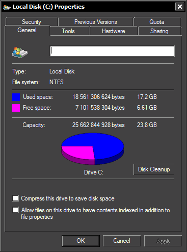
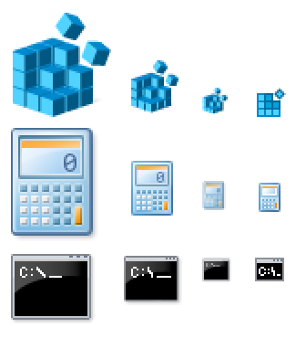
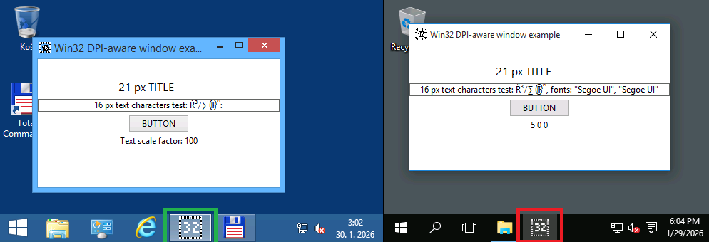
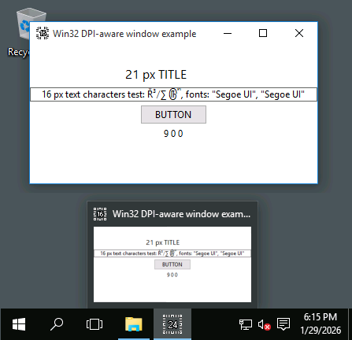

:arrow_backward: [The state of Windows](README.md)

# The abysmal state of Taskbar icons of Windows 11

[Click here to skip to the actual issue](#the-problem)

## Prologue

I was raised on classic Mac OS 7. My friends, as a kid, were Linux nerds. Despite that I eventually chose Windows all those years back.
One reason was its powerful API, to write my apps in. But the main reason was its emphasis on consistency and pixel-perfect graphics.

If I'm supposed to be starring at something 12 hours a day, it better be intuitive, look crisp and not strain my eyesight.

Those things were achieved through heavily hinted [ClearType](https://learn.microsoft.com/en-us/typography/cleartype/) text rendering,
GUI with customizable colors and proper contrast,
and small icons being hand-crafted simplified variantions of the regular ones. Not just naively resized down to ugly blurry blobs of colors.

This rant is about the icons.

 

## History

On Windows, when an application creates a window, it specifies two icons for it.

### Before *"Chicago"*

First it was just one icon, of 32×32 px, which we now call a *"large"*
or [ICON_BIG](https://learn.microsoft.com/en-us/windows/win32/winmsg/wm-geticon)
or being of [SM_CXICON](https://learn.microsoft.com/en-us/windows/win32/api/winuser/nf-winuser-getsystemmetrics) size.

The size is (or rather used to be) customizable, and of course scales with DPI.  
On 200% scaling it's 64×64 px.

This icon used to represent running minimized application on the Desktop.

 

### Windows 95/NT4 to 8.1

With revamped GUI, applications now can (and should, and usually do)
[specify](https://learn.microsoft.com/en-us/windows/win32/api/winuser/ns-winuser-wndclassexw) also
the [ICON_SMALL](https://learn.microsoft.com/en-us/windows/win32/winmsg/wm-geticon) icon.
The [UX Guide](https://learn.microsoft.com/en-us/windows/win32/uxguide/vis-icons) provides guidelines on how one should look.

This small icon too provides a representation of the application, but simplified enough,
so that it's still clear and recognizable at only 16×16 pixels.
Fitting various lists and, of course, window's title bar.

As you can see in the picture, if the regular/large icon was simply scaled down (3rd column), it would be blurry, ugly and almost unrecognizable.
But hand-crafted small icon (4th column) looks significantly better.
Note that the scaledown still happens automatically if the application doesn't provide one.

So when Windows needed to display UI regarding applications, like Taskbar, Alt+Tab, Win+Tab or Task Manager, it had a choice:
If the application identity recognition was crucial, like on Taskbar, it **asked it** for the large icon; and painted it large.
If it was for some kind of list, it would **ask it** for the small icon; and paint the small icon.
This approach kept the whole GUI nice and crisp (pixel-perfect).

And for a time, it was good.

## Windows 10

The first crack in this beautiful and consistent state of affairs appears with Windows 10 Technical Preview.
For some reason it was decided that Taskbar icons were too big, and that they should be 24×24 px of size instead.
So a half way between small and large.

Mind you, these were not the first 24×24 px icons. Start Menu used this size since Windows 95.
But Start Menu didn't have to ask running application for such icon.
It would simply follow the .lnk shortcut to the .exe, and extract it itself. Or the closest one and scaled it.

What does the new Windows 10 Taskbar do?

It just gets the large icon, as per usual, and resizes it to 24×24. Poorly.  
See this comparison between Windows 8.1 and Windows 10, when the application provides 32×32 icon, as it's supposed to:

*(disregard the testing app, I'll get to it later)*

Well, it's just a Technical Preview, I thought; they'll complete and polish it later.
They will give us new API, perhaps [SM_CXTASKBARICON](https://learn.microsoft.com/en-us/windows/win32/api/winuser/nf-winuser-getsystemmetrics) metrics,
or [ICON_TASKBAR](https://learn.microsoft.com/en-us/windows/win32/winmsg/wm-geticon) query constant,
or [WNDCLASSEX2](https://learn.microsoft.com/en-us/windows/win32/api/winuser/ns-winuser-wndclassexw) with new `hTaskbarIcon` member,
or a way to manifest the application, so that everything will work in some other way.

It was late 2014 and I was so damn naive.

But still, when the shiny brand new
[Feedback Hub](https://support.microsoft.com/en-us/windows/send-feedback-to-microsoft-with-the-feedback-hub-app-f59187f8-8739-22d6-ba93-f66612949332)
was introduced along with TP3, I decided to file an issue about this. Just so they know.

Yeah.

No API surface was ever provided AT ALL to the developers. And still wasn't **to this very day.**  
My Feedback Hub issue has long since been deleted, and the Feedback Hub as a whole was purged several times since.

Today, if an application wishes to have nice and crisp icon on the Taskbar, it checks Windows version
(after navigating through the [compatibility lies](https://learn.microsoft.com/en-us/windows/win32/sysinfo/targeting-your-application-at-windows-8-1)),
and uses 24×24 (scaled by DPI) when on Windows 10 or later.
This is exactly what my [example testing app](https://github.com/tringi/win32-dpi) in the screenshot on the left does.

So what happens if Microsoft changes it again?

That's a very valid question.

Ugly icons will happen.

Again.

That's the answer.

We just hope to see the change in the [Insider Program](https://www.microsoft.com/windowsinsider/) early enough to adapt our apps,
before the build reaches maturity. And users.

 
 

### This breaks when the app is pinned though

Because the Taskbar internally uses [Shell Image Lists](https://learn.microsoft.com/en-us/windows/win32/api/shellapi/nf-shellapi-shgetimagelist)
for pinned icons, and these still respect ICON_BIG/SM_CXICON system metrics, it will
[extract](https://learn.microsoft.com/en-us/windows/win32/api/shellapi/nf-shellapi-extracticonexw) 32×32 icon and again, poorly resize it to 24×24.

There is an API (TBD: Add link), through which the application can provide its own icon to be used for pinned button.
So naturally one would try and provide icon of 24×24 pixels in size. This doesn't work.
It's added to the aforementioned image list, thus first resized to 32×32, and then resized again to 24×24, which looks even worse.

## The testing tool

