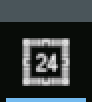
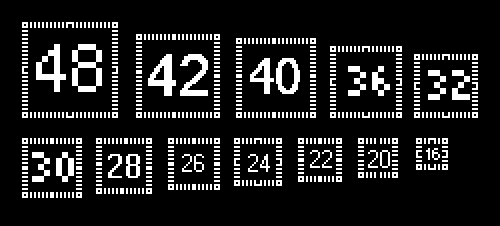
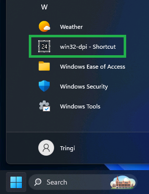
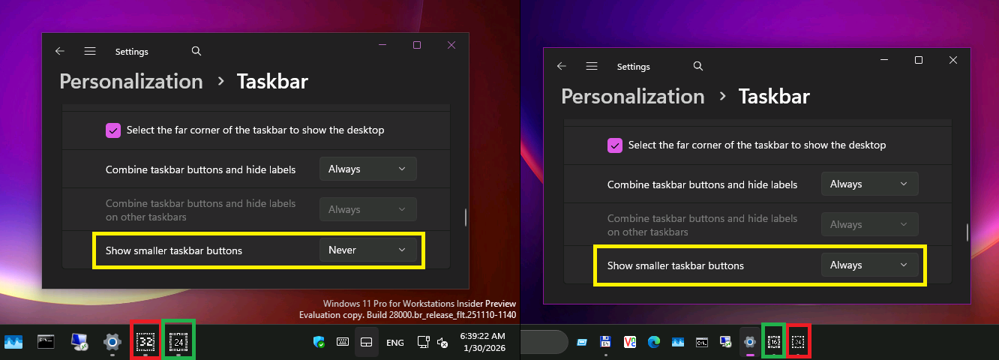

:arrow_backward: [The state of Windows](README.md)

# The abysmal state of Taskbar icons of Windows 11

[Click here to skip to the actual issue](#windows-11)

## Prologue

I was raised on classic Mac OS 7. My friends, as a kid, were Linux nerds. Despite that I eventually chose Windows all those years back.
One reason was its powerful API, to write my apps in. But the main reason was its emphasis on consistency and pixel-perfect graphics.

If I'm supposed to be starring at something 12 hours a day, it better be intuitive, look crisp and not strain my eyesight.

Those things were achieved through heavily hinted [ClearType](https://learn.microsoft.com/en-us/typography/cleartype/) text rendering,
GUI with customizable colors and proper contrast,
and small icons being hand-crafted simplified variantions of the regular ones. Not just naively resized down to ugly blurry blobs of colors.

This rant is about the icons.

 

## History

On Windows, when an application creates a window, it specifies two icons for it.

### Before *"Chicago"*

First it was just one icon, of 32×32 px, which we now call a *"large"*
or [ICON_BIG](https://learn.microsoft.com/en-us/windows/win32/winmsg/wm-geticon)
or being of [SM_CXICON](https://learn.microsoft.com/en-us/windows/win32/api/winuser/nf-winuser-getsystemmetrics) size.

The size is (or rather used to be) customizable, and of course scales with DPI.  
On 200% scaling it's 64×64 px.

This icon used to represent running minimized application on the Desktop.

 

### Windows 95/NT4 to 8.1

With revamped GUI, applications now can (and should, and usually do)
[specify](https://learn.microsoft.com/en-us/windows/win32/api/winuser/ns-winuser-wndclassexw) also
the [ICON_SMALL](https://learn.microsoft.com/en-us/windows/win32/winmsg/wm-geticon) icon.
The [UX Guide](https://learn.microsoft.com/en-us/windows/win32/uxguide/vis-icons) provides guidelines on how one should look.

This small icon too provides a representation of the application, but simplified enough,
so that it's still clear and recognizable at only 16×16 pixels.
Fitting various lists and, of course, window's title bar.

As you can see in the picture, if the regular/large icon was simply scaled down (3rd column), it would be blurry, ugly and almost unrecognizable.
But hand-crafted small icon (4th column) looks significantly better.
Note that the scaledown still happens automatically if the application doesn't provide one.

So when Windows needed to display UI regarding applications, like Taskbar, Alt+Tab, Win+Tab or Task Manager, it had a choice:
If the application identity recognition was crucial, like on Taskbar, it **asked it** for the large icon; and painted it large.
If it was for some kind of list, it would **ask it** for the small icon; and paint the small icon.
This approach kept the whole GUI nice and crisp (pixel-perfect).

And for a time, it was good.

## Windows 10

The first crack in this beautiful and consistent state of affairs appears with Windows 10 Technical Preview.
For some reason it was decided that Taskbar icons were too big, and that they should be 24×24 px of size instead.
So a half way between small and large.

Mind you, these were not the first 24×24 px icons. Start Menu used this size since Windows 95.
But Start Menu didn't have to ask running application for such icon.
It would simply follow the .lnk shortcut to the .exe, and extract it itself. Or the closest one and scaled it.

What does the new Windows 10 Taskbar do?

It just gets the large icon, as per usual, and resizes it to 24×24. Poorly.  
See this comparison between Windows 8.1 and Windows 10, when the application provides 32×32 icon, as it's supposed to:

*(disregard the testing app, I'll get to it later)*

Well, it's just a Technical Preview, I thought; they'll complete and polish it later.
They will give us new API, perhaps [SM_CXTASKBARICON](https://learn.microsoft.com/en-us/windows/win32/api/winuser/nf-winuser-getsystemmetrics) metrics,
or [ICON_TASKBAR](https://learn.microsoft.com/en-us/windows/win32/winmsg/wm-geticon) query constant,
or [WNDCLASSEX2](https://learn.microsoft.com/en-us/windows/win32/api/winuser/ns-winuser-wndclassexw) with new `hTaskbarIcon` member,
or a way to manifest the application, so that everything will work in some other way.

It was late 2014 and I was so damn naive.

But still, when the shiny brand new
[Feedback Hub](https://support.microsoft.com/en-us/windows/send-feedback-to-microsoft-with-the-feedback-hub-app-f59187f8-8739-22d6-ba93-f66612949332)
was introduced along with TP3, I decided to file an issue about this. Just so they know.
I also listed several possible easy solutions, even though I felt weird. Who was I to advise Microsoft programmers?

Yeah.

No API surface was ever provided AT ALL. And still isn't **to this very day.**  
My Feedback Hub issue has long since been deleted, and the Feedback Hub as a whole was purged several times since.

Today, if an application wishes to have nice and crisp icon on the Taskbar, it checks Windows version
(after navigating through the [compatibility lies](https://learn.microsoft.com/en-us/windows/win32/sysinfo/targeting-your-application-at-windows-8-1)),
and uses 24×24 (scaled by DPI) when on Windows 10 or later.
This is exactly what my [example testing app](https://github.com/tringi/win32-dpi) in the screenshot on the left does.

So what happens if Microsoft changes it again?

That's a very valid question.

Ugly icons will happen.

Again.

That's the answer.

We just hope to see the change in the [Insider Program](https://www.microsoft.com/windowsinsider/) early enough to adapt our apps,
before the build reaches maturity. And users.

 
 

### This breaks when the app is pinned though

Because the Taskbar internally uses [Shell Image Lists](https://learn.microsoft.com/en-us/windows/win32/api/shellapi/nf-shellapi-shgetimagelist)
for pinned icons, and these still respect ICON_BIG/SM_CXICON system metrics, it will
[extract](https://learn.microsoft.com/en-us/windows/win32/api/shellapi/nf-shellapi-extracticonexw) 32×32 icon and again, poorly resize it to 24×24.

Pinned application icon then looks again like the red-outlined one in the Windows 8.1 and 10 comparison above.

There is an API (TBD: Add link) though, through which the application can provide its own icon to be used for pinned button.
So naturally one would try and provide an icon of 24×24 pixels in size. This too doesn't work.
Such icon is added to the aforementioned image list, thus first resized to 32×32, and then resized again to 24×24, which looks even worse.

## The testing tool

Before we continue, let me introduce the ["Win32 DPI-aware window example"](https://github.com/tringi/win32-dpi) (open source) testing tool,
that you see in the screenshots.
Its primary function is to act as a starting point for programmers who wish their apps to properly support high DPI displays on full range of old and new Windows.

Here we use it, because it contains a special hand-crafted icon to show which resolution was actually loaded,
with pixelated black and white borders to clearly reveal if any unwanted resizing is happening.

Using this icon we can see, from a glance, where Windows is using wrong icon, and which one it is.

## Windows 11

And then programmers at Microsoft rewrote Taskbar for Windows 11 and things got worse:

*(intentionally running on build 22000 to demonstrate the age of the issue)*

In the screenshot above I started two identical copies of the testing tool, but **one got incorrect icon.**
Both instances are telling the OS to use the proper 24×24 px icon, so why is that? 

**The first one has shortcut in Start Menu!**

And that makes the Taskbar to completely ignore the application-supplied window icon.
The Taskbar uses only the icon specified in the shortcut; and in incorrect size.

The frustrating part here is, that this is actually a smart approach.

Taskbar can reach the EXE file itself through the shortcut file (.lnk).
It could easily extract the icon of **the proper** size, whether applications do our trick above (detecting Windows 10) or not.
But, for some reason, it doesn't.
One could argue that the reason is underlying use of the Shell Image List that I mentioned above,
but that's probably not it, since the Taskbar was rewritten from scratch.

And Start Menu does the same, yet extracts a nice crisp proper 24×24 px icon.  
See the screenshot on the right:

 

## Windows 11 26H1

It gets even worse:

The upcoming version of Windows 11 introduces *"smaller taskbar buttons"*. Mind you, just buttons, not smaller Taskbar, like many users wanted.
And of course, it doesn't render small icons properly either. But now it fails in the opposite manner.

As you can see in the right screenshot above, when small buttons are set, a window of the application with shortcut uses correct 16×16 icon,
but the window without one uses the large (32×32 or 24×24, whichever the application provided) icon, just ugly resized to 16×16.
Again, despite there being simple direct API for the Taskbar to obtain this small icon, it doesn't use it.

At least when pinned, both render correctly.

## The solution

A rant would be a waste of time if it didn't provide a solution, so here's mine.
Despite it being obvious, let me spell out the proper algorithm.

For regular-sized Taskbar:

* If the window provides 24×24 icon, use that.
* If the window provides 32×32 icon, use the new approach: If it has a Start Menu shortcut, load 24×24 version of the icon set in that shortcut.
* Only then, if neither applies, use window's large icon and resize it down.
* Create distinct 24×24 image list for large pinned icons.

For small Taskbar:

* If the application doesn't have Start Menu shortcut, use small window icon, not the large one, duh.

## Feedback Hub report

Before I analyzed this issue deeper, I created [this issue](https://aka.ms/AAxichs) on Feedback Hub.
If you believe this should be fixed, please click the link and give it an upvote.
